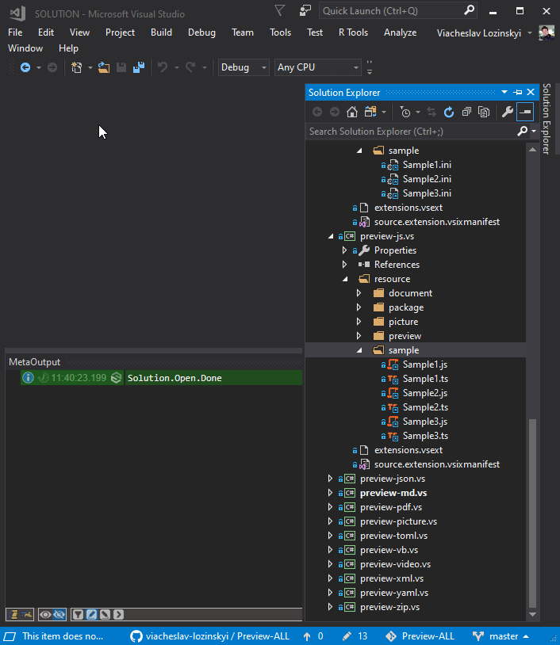

### Now you can look inside [JS](https://en.wikipedia.org/wiki/JavaScript) and [TS](https://en.wikipedia.org/wiki/TypeScript) source files not opening it.
---

---
Download the extension from the [Visual Studio Marketplace](https://marketplace.visualstudio.com/items?itemName=ViacheslavLozinskyi.Preview-JS)

---
Data visualization is based on [MetaProject](https://marketplace.visualstudio.com/items?itemName=ViacheslavLozinskyi.MetaProject)

Data extraction is based on [TypeScriptAST](https://github.com/ToCSharp/TypeScriptAST)